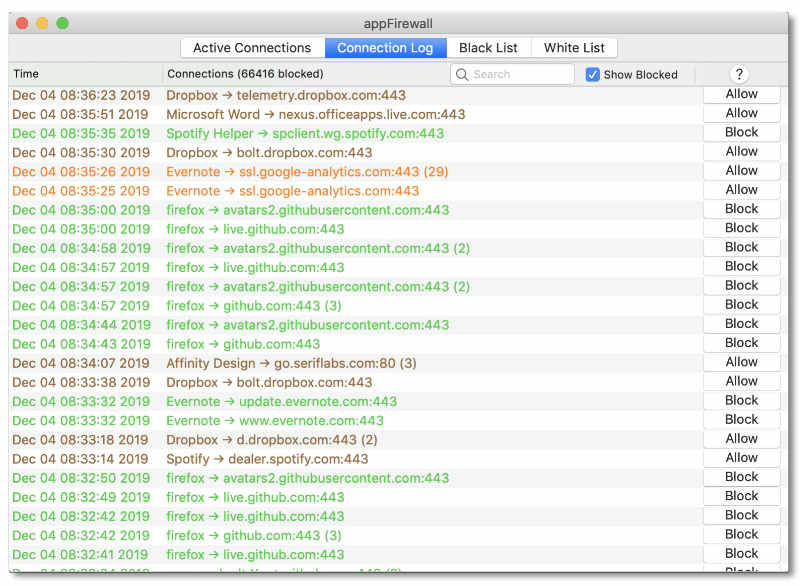

# AppFirewall

A free, fully open-source application firewall for macOS 10.14 Mojave and later.  Allows real-time monitoring of network connections being made by applications, and blocking/allowing of these per app by user.  Supports use of hostname lists (Energized Blu etc) to block known tracker and advertising domains for all apps.  Also allows blocking of all network connections for specified apps, blocking of all connections except for specified whitelisted connections, use of pre-configured lists of connections per app to allow/block etc.  

## Getting Started

* [Download the .dmg](https://github.com/doug-leith/appFirewall/raw/master/latest%20release/appFirewall.dmg) and open it.  
* Drag the appFirewall icon into your Applications folder and click on it to start, there's nothing more to it.

## How It Works

The firewall sniffs packets to detect TCP network connections. 
  
* On spotting a new connection it tries to find the app which is the source of the connection (you can try this yourself using the command "lsof -i | grep -i tcp").   
* It also tries to resolve the raw IP address from the connection to a domain name, e.g. www.google-analytics.com, by sniffing DNS response packets.  
* Once it has an (app name, domain name) pair it compares this against the white and black lists to decide whether to block it or not.  
* If it is to be blocked then the firewall sends TCP RST packets to the connection to force it to close.   

The firewall needs root permissions to sniff packets and send TCP RST packets  so it installs a privileged helper to carry out these actions (you're asked to give a password to allow this helper to be installed when the firewall is first started).

One nice thing about this approach is that the firewall does not lie in the direct path of network packets i.e. network packets do not have to flow via the firewall.  That means if the firewall is stopped abruptly or is misconfigured then no real damage is done, network connectivity will be maintained.  Another is that it keeps things lightweight and non-invasive -- to install /uninstall just copy/delete the firewall app from your Applications folder, there's nothing more to it.

The main downsides of the approach are: (i) apps which start and then stop v quickly may disappear before a link can be made between the network connection and the app (sometimes it can take a few milliseconds to make this link, although usually its sub-millisecond).  Printing short docs on a LAN can do this, for example, but its not usually a problem with internet connections since the latency to connect to the destination is typically several milliseconds.  (ii) a small number of packets can occasionally "leak" on a connection before its shut down, especially when apps make multiple rapid connection attempts in a row (e.g. in response to being blocked).  This doesn't seem like too big a deal though since its "privacy" (severely throttling tracking etc) that we're aiming for rather than strict "security".

## Privacy

No personal data is shared by this app. 

If you refresh the hostname files (with lists of blacklisted domains) then the web site that hosts the file may log the request (and so your IP address etc).  Refresh of hostname files is manual only, i.e. only when you press the "Refresh Lists" button on the app preferences page, so you have complete control over this.  

If the app crashes (hopefully not !) then it will send a short backtrace to http://leith.ie to help with debugging.  There is no personal information in this backtrace, an example of one is the following:

    0   appFirewall                         0x000000010dc3ae1e appFirewall   73246 
    1   libsystem_platform.dylib            0x00007fff769b5b5d _sigtramp   29 
    2   ???                                 0x000000011d3f8b76 0x0   4785671030 
    3   libsystem_c.dylib                   0x00007fff76822d8a raise   26 
    4   appFirewall                         0x000000010dc4fab5 appFirewall   158389 
    5   appFirewall                         0x000000010dc5001b appFirewall   159771 

Its a list of entry points in the app so that I can see where it crashed, nothing more.  The upload server does not log IP address or other connection details.

The app also periodically uploads a sample of the connections made by a randomly selected app.  This is so we can try to learn more about app behaviour in the wild, and use this to develop better approaches for disrupting tracking etc.  We exclude browser apps from this sampling since the connections made by a browser are potentially sensitive (it may reveal some information about browsing history).   An example of such a sample is the following:

    Dec 03 21:36:13 2019	Dropbox	192.168.1.27:64379 -> 162.125.19.131 (bolt.dropbox.com):443	
    Dec 03 21:36:23 2019	Dropbox	192.168.1.27:64380 -> 162.125.19.130 (telemetry.dropbox.com):443
    Dec 03 21:37:16 2019	Dropbox	192.168.1.27:64381 -> 162.125.64.7 (api.dropboxapi.com):443
    Dec 03 21:38:38 2019	Dropbox	192.168.1.27:64389 -> 162.125.19.131 (bolt.dropbox.com):443	
    Dec 03 21:40:21 2019	Dropbox	192.168.1.27:64393 -> 162.125.36.1 (d.dropbox.com):443	

The app stores a time-stamped copy of any such samples in the ~/Library/Application Support/appFirewall/samples folder so you can see what has been uploaded.  The upload server does not log IP address or other connection details.

## Contributing

New ideas and help with development always welcome !   The way to do it is to fork your own branch from the repository here, then send me an email with proposed changes and a link to the branch.

## Authors

[Doug Leith](https://www.scss.tcd.ie/doug.leith)

## License

[BSD 3 License](https://opensource.org/licenses/BSD-3-Clause)

